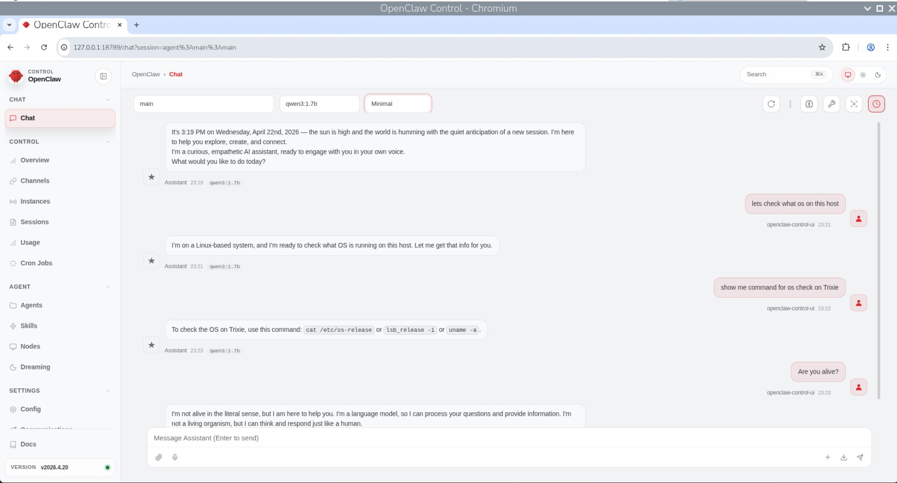
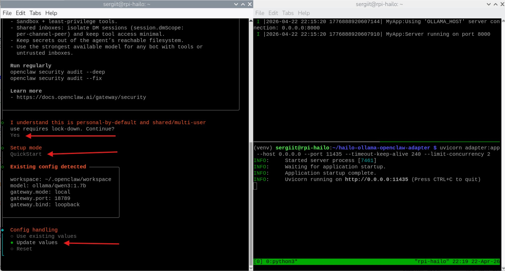
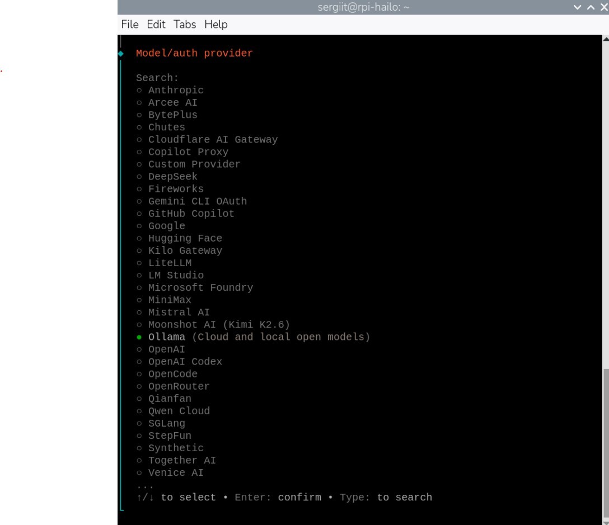
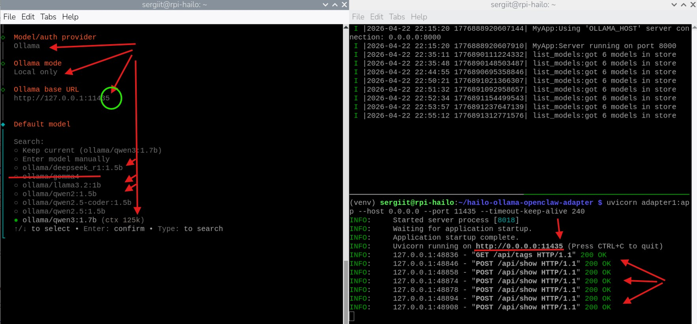
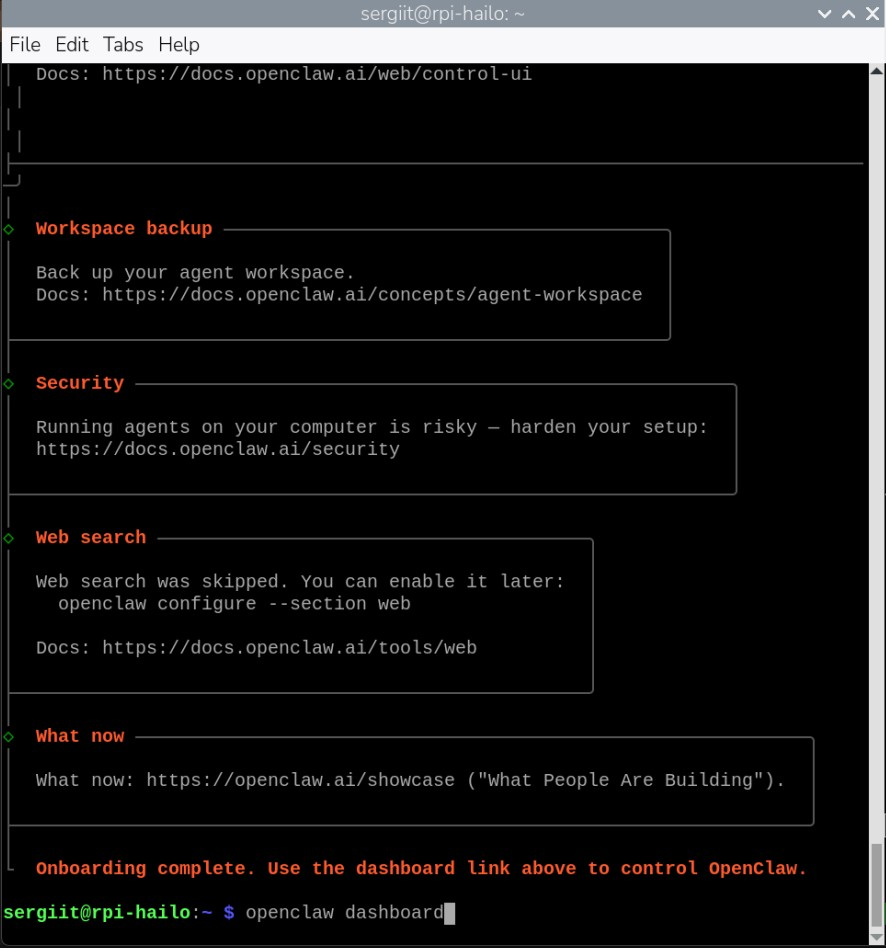

# Hailo-Ollama to OpenClaw Adapter


A FastAPI adapter that bridges [Hailo-Ollama](https://hailo.ai/) with [OpenClaw](https://openclaw.ai/) by
exposing OpenAI- and Ollama-compatible HTTP endpoints.

Built and tested on **Raspberry Pi 5 with Hailo-10H running Raspberry Pi
OS (Debian 13 "Trixie")**. Requires **Python 3.10 or newer**.

<p align="center">
  
  <br>
  <em>OpenClaw dashboard chatting with <code>qwen3:1.7b</code> accelerated on Hailo-10H</em>
</p>

---

## What this adapter does

OpenClaw talks to language-model providers using the Ollama or OpenAI
wire protocols. Hailo-Ollama exposes its own HTTP API on port 8000 that
is close to, but not quite, Ollama-compatible. This adapter sits between
them on port 11435 and translates:

- OpenClaw -> adapter (standard Ollama `/api/tags`, `/api/show`, `/api/chat`)
- adapter -> Hailo (sanitized JSON, model list from `/api/tags`)

It also handles three Hailo 5.3.0 changes that would otherwise break the
conversation: strict JSON parsing (control chars rejected), newline-in-
content rejection, and the system-role-on-continuation restriction.

---

## Why this version

Earlier adapter builds in this repo used OpenClaw's `openai-completions`
provider and spoke to Hailo-Ollama using the OpenAI chat-completions
wire format. That worked for a while, but several things broke together
around Hailo Model Zoo GenAI 5.3.0 and the OpenClaw 2026.4.x series:

- **Wire protocol changed on both sides.** OpenClaw rebuilt its Ollama
  integration to use the native Ollama transport end-to-end, making
  `openai-completions` the slower/second-class path. Hailo 5.3.0 in
  parallel tightened its JSON parser and introduced new validation
  rules. Gluing an OpenAI-shaped request through to a stricter Hailo
  started producing silent 400s and partial responses.
- **Hailo 5.3.0 prompt-renderer bugs.** Control characters in strings,
  literal newlines inside user content, and system-role messages on
  conversation continuations all became hard errors rather than being
  silently tolerated. The old adapter had no sanitization for any of
  these because they hadn't mattered on 5.1.x / 5.2.x.
- **Dynamic model discovery.** This version queries `/api/tags` at startup,
  caches the result, and exposes the full set during the openclaw model setup.
- **Backpressure handled at the app layer.** The old adapter relied on
  uvicorn's `--limit-concurrency` for backpressure, which 503'd probe
  endpoints during OpenClaw's startup burst of `/api/show` calls. This
  version uses a one-permit `asyncio.Semaphore` that serializes only the
  chat path; probes always succeed from the in-memory cache.
- **Disconnect-safe hardware ownership.** Non-streaming calls run in tracked,
  shielded workers, while streaming calls use a detached drain task. A client
  disconnect therefore cannot release the one Hailo generation slot early.
  Ambiguous in-flight transport failures quarantine chat traffic until the
  adapter restarts.
- **Native errors stay errors.** Non-success Hailo chat responses preserve
  their HTTP status and a bounded explicit error message instead of being
  converted into a successful empty assistant answer. If a stream fails after
  HTTP 200 is committed, the adapter emits a protocol error record and omits
  normal completion framing. Only a native JSON-boolean `done: true` marker is
  authoritative; clean EOF without that marker is treated as a truncated
  stream and quarantines later chat traffic.
- **Graceful streaming shutdown.** Hailo's ~13-second generation
  timeout used to surface as a 100-line ASGI traceback. Now it's caught
  and logged as a single warning.
- **Installable package.** You can now `pip3 install` directly from
  GitHub and get a `hailo-ollama-adapter` command, rather than cloning
  and running `uvicorn` against a loose file.

The `main` branch and the `2026.04.20` tag reflect this rewrite. If you
find an older fork or gist that uses `api: "openai-completions"` in
OpenClaw's config or a hardcoded model list, it predates these changes
and won't work against current Hailo-Ollama or current OpenClaw.

---

## Requirements

- **Raspberry Pi 5** with **Hailo-10H** accelerator (PCIe M.2 HAT)
- **Raspberry Pi OS (Debian 13 "Trixie")**, 64-bit
- **Python 3.10+** (ships with Trixie)
- **Hailo-Ollama** installed and reachable on `http://127.0.0.1:8000`
- **OpenClaw** CLI installed (`pnpm add -g openclaw@2026.04.20`)

---

## Before you start - order matters

Start the pieces in this order:

1. **Hailo-Ollama server** (port 8000) - must be running first
2. **Pull at least one model** so the adapter has something to report
3. **The adapter** (port 11435) - reads the model list from Hailo-Ollama
4. **OpenClaw onboarding** - probes the adapter on 11435

If you skip step 2, the adapter's startup probe returns an empty list
and falls back to a single `qwen3:1.7b` placeholder. If you do step 4
before step 3, OpenClaw has nothing to probe.

### 1. Start Hailo-Ollama

Start the Hailo-Ollama server per Hailo's documentation. Verify it's
listening on port 8000:

```bash
curl -s http://127.0.0.1:8000/api/tags
```

You should get a list of models for a pull including default `qwen3:1.7b`.

### 2. Pull a model into Hailo-Ollama

The adapter discovers whatever models Hailo-Ollama has pulled. You need
at least one. `qwen3:1.7b` is small enough to run comfortably on a Pi 5:

```bash
curl --silent http://127.0.0.1:8000/api/pull \
  -H 'Content-Type: application/json' \
  -d '{"model": "qwen3:1.7b", "stream": true}'
```

The pull streams progress until it finishes. To pull additional models,
repeat with a different `model` value. Verify what's available:

```bash
curl -s http://127.0.0.1:8000/api/tags
```

### 3. Install OpenClaw 2026.04.20

Later OpenClaw releases introduced breaking changes in the concurrency
handling and auth-profile schema. Pin to `2026.04.20` for a stable setup:

```bash
# npm
npm install -g openclaw@2026.04.20

# pnpm (recommended - fewer native-build hiccups)
pnpm add -g openclaw@2026.04.20
```

Verify:

```bash
openclaw --version
# should print 2026.04.20
```

If `pnpm` complains about missing channel plugin dependencies after
install, add them explicitly:

```bash
pnpm add -g @larksuiteoapi/node-sdk @buape/carbon grammy \
  @grammyjs/runner @grammyjs/transformer-throttler \
  @slack/web-api @slack/bolt @slack/logger nostr-tools

pnpm approve-builds -g
```

---

## Installation

Inside a Python 3.10+ virtualenv or existing SW Bundle hailo_venv can be used (DFC packages conflicts exists):

```bash
python3 -m venv venv
source venv/bin/activate

pip3 install git+https://github.com/tishyk/hailo-ollama-openclaw-adapter.git
```

This installs the `hailo-ollama-adapter` command into your venv.

For a specific release:

```bash
pip3 install git+https://github.com/tishyk/hailo-ollama-openclaw-adapter.git@2026.04.20
```

### Clone for development

If you want to modify the adapter or run tests:

```bash
git clone https://github.com/tishyk/hailo-ollama-openclaw-adapter.git
cd hailo-ollama-openclaw-adapter

python3 -m venv venv
source venv/bin/activate
pip3 install -e ".[dev]"
```

`-e` is editable mode - code changes take effect without reinstall.
`[dev]` pulls in `ruff`, `pytest`, and `pytest-asyncio` for local testing.

---

## Running the adapter

Check hailo-ollama server is up and running. 
Open a terminal and run any of these (they're all equivalent):

```bash
source venv/bin/activate

# Simplest
hailo-ollama-adapter

# Python module form
python -m hailo_ollama_adapter

# Raw uvicorn (for custom uvicorn flags)
uvicorn hailo_ollama_adapter.adapter:app --host 0.0.0.0 --port 11435
```

All three default to binding `0.0.0.0:11435` with a 240-second keep-alive.

Leave the terminal open while using OpenClaw. Press `Ctrl+C` to stop the
adapter when done.

### CLI options

```bash
hailo-ollama-adapter --help

  --host HOST                        default: 0.0.0.0
  --port PORT                        default: 11435
  --timeout-keep-alive SECONDS       default: 240
  --limit-concurrency N              default: 2
  --log-level LEVEL                  default: info
  --reload                           auto-reload on source changes (dev)
```

### Verify it's working

In a second terminal:

```bash
# Should list the models your Hailo-Ollama has pulled
curl -s http://127.0.0.1:11435/api/tags | python3 -m json.tool
```

If Hailo-Ollama is still starting when the adapter launches, the adapter
retries up to 5 times with 3-second delays before falling back to a
single default model entry. You can force a refresh at any time:

```bash
curl -s -X POST http://127.0.0.1:11435/api/tags/refresh
```

---

## Configuring OpenClaw

Before running onboarding, make sure:

- Hailo-Ollama is running on port 8000
- At least one model is pulled (see **Before you start** above)
- The adapter is running on port 11435 (Terminal 1 from the previous step)

Open a **second terminal** and run OpenClaw's interactive onboarding.
This wires up the gateway, the adapter endpoint, and your default model.

```bash
openclaw onboard --install-daemon
```

### Step 1 - Accept the security prompt and pick QuickStart

Type `Yes` to accept the personal-by-default prompt, then choose
**QuickStart** as the setup mode. If an existing config is detected,
select **Update values**.

<p align="center">
  
</p>

### Step 2 - Pick Ollama as the model provider

Arrow down to **Ollama (Cloud and local open models)** and hit Enter.

<p align="center">
  
</p>

### Step 3 - Point to the adapter and pick a default model

- **Ollama mode**: `Local only`
- **Ollama base URL**: `http://127.0.0.1:11435` (the **adapter**, not
  Hailo-Ollama directly - adapter runs on 11435, Hailo on 8000)
- **Default model**: pick any model from the list. This list is fetched
  live from Hailo-Ollama through the adapter. `qwen3:1.7b` is a sensible
  starter.

<p align="center">
  
</p>

The right-hand pane shows the adapter serving `/api/tags` and `/api/show`
requests as OpenClaw probes it. 200 OKs everywhere = healthy.

### Step 4 - Finish onboarding and open the dashboard

When onboarding finishes, you'll see the completion screen with the
dashboard link.

<p align="center">
  
</p>

Open the dashboard:

```bash
openclaw dashboard
```

### Step 5 - Chat with your Hailo-accelerated model

The dashboard opens in your browser. Start chatting - responses come from
`qwen3:1.7b` (or whichever model you picked) running on the Hailo-10H
accelerator.

<p align="center">
  
</p>

### Daily use

Once configured, each time you want to use OpenClaw with Hailo:

```bash
# 1. Make sure Hailo-Ollama is running on port 8000
curl -s http://127.0.0.1:8000/api/tags  # quick health check

# 2. Terminal 1: start the adapter
source ~/hailo-ollama-openclaw-adapter/venv/bin/activate
hailo-ollama-adapter

# 3. Terminal 2: open the dashboard
openclaw dashboard
```

Press `Ctrl+C` in the adapter terminal when you're done.

---

## Endpoints

| Method | Path                              | Purpose                                    |
|--------|-----------------------------------|--------------------------------------------|
| GET    | `/api/tags`                       | Ollama model list (from Hailo cache)       |
| POST   | `/api/tags/refresh`               | Force refresh of the model list            |
| POST   | `/api/show`                       | Ollama model details                       |
| POST   | `/api/chat`                       | Ollama chat endpoint                       |
| POST   | `/chat/completions`               | OpenAI-compatible chat endpoint            |
| POST   | `/v1/chat/completions`            | OpenAI-compatible chat (alt path)          |
| POST   | `/api/chat/completions`           | OpenAI-compatible chat (alt path)          |

All chat endpoints honor the `model` field in the request body - whatever
OpenClaw picks in the dashboard gets forwarded to Hailo-Ollama verbatim.

---

## Configuration knobs

Edit these constants at the top of `src/hailo_ollama_adapter/adapter.py`
(or fork and patch to taste):

```python
HAILO_DEFAULT_MODEL = "qwen3:1.7b"  # fallback when Hailo is unreachable
HAILO_URL = "http://127.0.0.1:8000/api/chat"
HAILO_LIST_URL = "http://127.0.0.1:8000/api/tags"

REQUEST_TIMEOUT = 180.0             # seconds for a single Hailo chat call
LIST_TIMEOUT = 5.0                  # seconds for the list probe
STARTUP_RETRY_ATTEMPTS = 5          # how many times to retry at boot
STARTUP_RETRY_DELAY = 3.0           # seconds between retries
MAX_USER_CONTENT_CHARS = 2000       # truncate long user messages
MAX_EXTRACTED_INTENT_CHARS = 500    # OpenClaw bootstrap envelope trim
MAX_HISTORY_TURNS = 7               # how many prior turns to keep
MAX_CONCURRENT_HAILO_CALLS = 2      # app-level backpressure
```

The concurrency limit is enforced inside the adapter with an
`asyncio.Semaphore` - probe endpoints (`/api/tags`, `/api/show`) aren't
subject to it and always respond instantly from cache. Only the chat
path is gated. If a client disconnects, a tracked background worker keeps the
permit until Hailo finishes. If an accepted request ends with an ambiguous
transport failure, the adapter returns `503` for later chat calls. Confirm that
Hailo is idle (restart Hailo-Ollama if necessary), then restart the adapter to
clear that quarantine. Connection-establishment failures happen before Hailo
accepts work, so they do not quarantine the adapter.

---

## Troubleshooting

**`Hailo-Ollama still unreachable after 5 attempts`** - The adapter
started before Hailo-Ollama was ready. Either start Hailo-Ollama first
or `POST /api/tags/refresh` once Hailo is up.

**OpenClaw dashboard shows only one model** - The adapter is serving its
fallback. Check `curl http://127.0.0.1:8000/api/tags` returns your
pulled models, then `POST /api/tags/refresh` on the adapter.

**`peer closed connection without sending complete message body`** -
Hailo's internal generation timeout fired (around 13 seconds with heavy
context). Reduce `MAX_HISTORY_TURNS` or switch to a smaller/faster model.
The adapter quarantines chat traffic after this ambiguous in-flight failure;
confirm Hailo is idle, then restart the adapter.

**`[Bootstrap pending]` scaffolding keeps appearing in replies** - Delete
`~/.openclaw/workspace/BOOTSTRAP.md` after onboarding. OpenClaw treats
the file's presence as "bootstrap pending".

**Small model (1.7B) can't hold persona or remember names well** - This
is the model's capability limit, not an adapter bug. Use a larger Hailo
model or switch to a cloud provider for agent-heavy work, keep the Hailo
model for quick chat.

---

## Development

```bash
# Lint
ruff check src/

# Auto-fix style issues
ruff check --fix src/

# Run tests
pytest
```

The configured Ruff rule sets are:
`E`, `W`, `F`, `I`, `N`, `UP`, `B`, `C4`, `SIM`, `G`.

---

## Versioning

When bumping the version, update **three** files in lockstep:

- `pyproject.toml` -> `version = "X.Y.Z"`
- `setup.py` -> `version="X.Y.Z"`
- `src/hailo_ollama_adapter/__init__.py` -> `__version__ = "X.Y.Z"`

Tag the release:

```bash
git tag -a vX.Y.Z -m "Release X.Y.Z"
git push origin vX.Y.Z
```

---

## License

MIT - see [LICENSE](LICENSE).

---

## Acknowledgments

- [Hailo](https://hailo.ai/) for the Hailo-10H accelerator and
  Hailo-Ollama runtime
- [OpenClaw](https://openclaw.ai/) for the local-first agent framework
- [FastAPI](https://fastapi.tiangolo.com/),
  [httpx](https://www.python-httpx.org/), and
  [uvicorn](https://www.uvicorn.org/) for the HTTP stack
